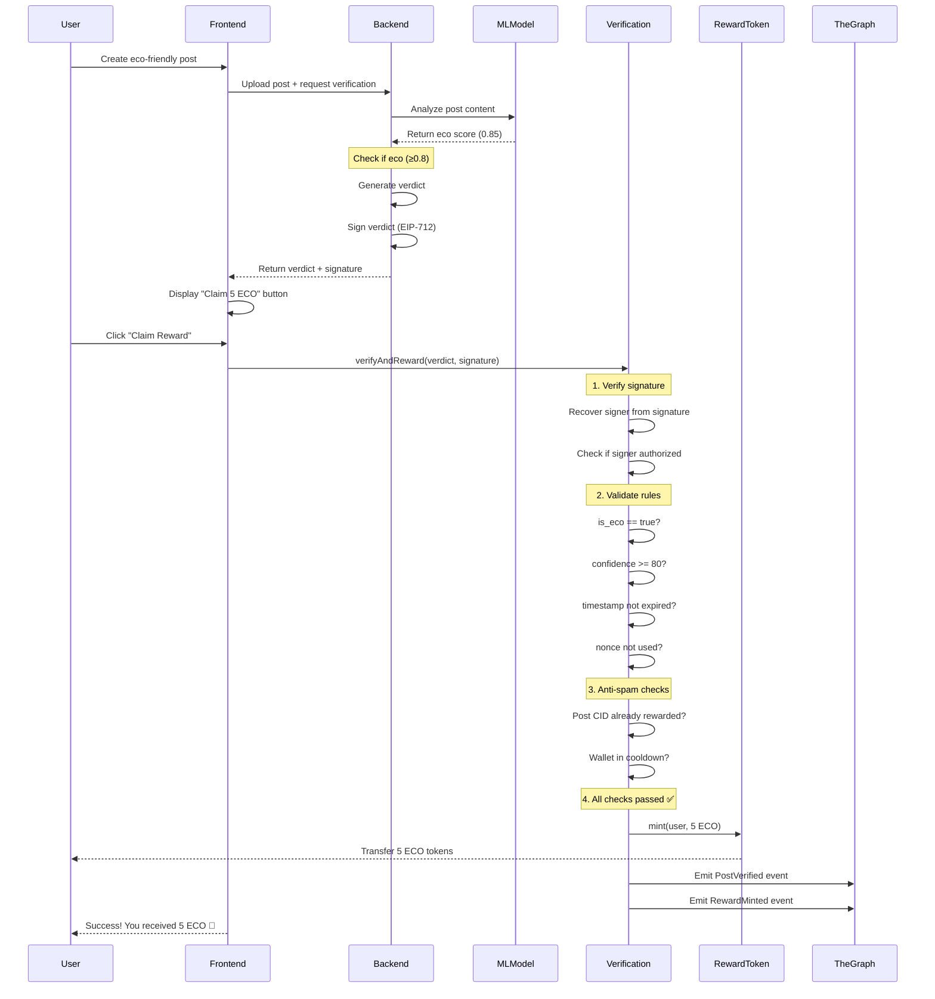
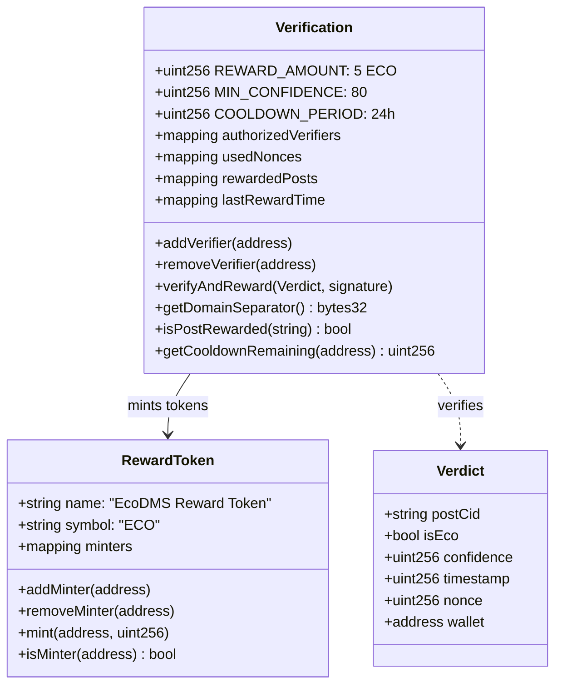
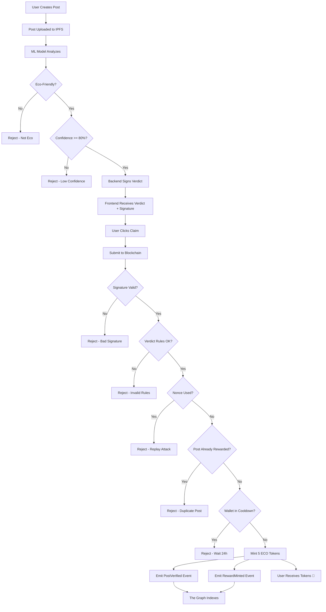
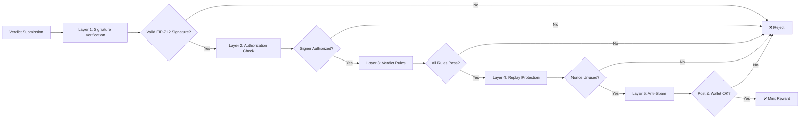
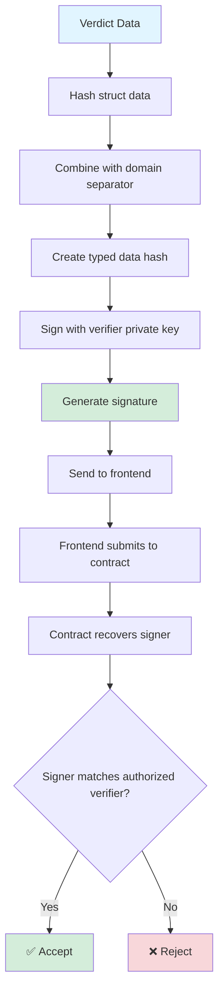
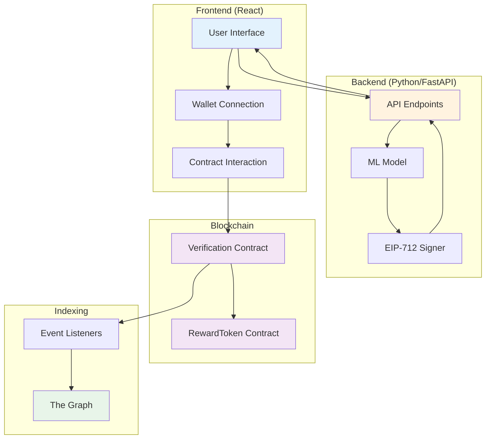
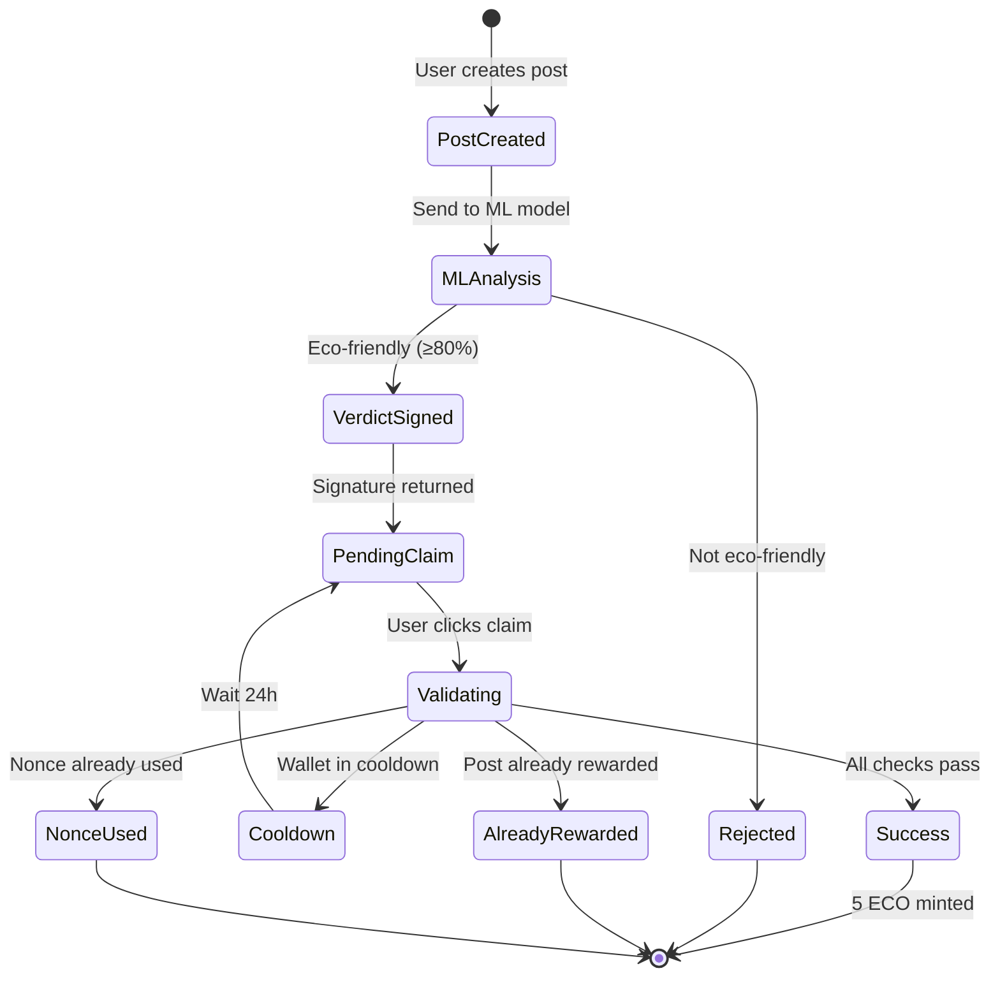
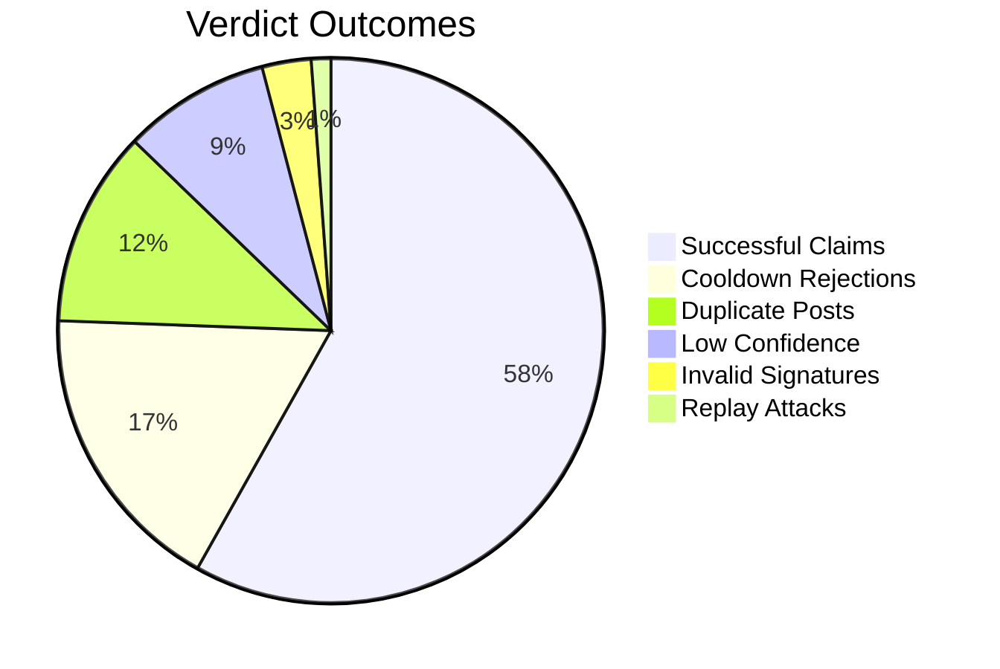

# Verification System Architecture

## System Flow Diagram

## Contract Architecture

## Data Flow

## Security Layers

## EIP-712 Signing Process

## Component Interaction

## State Management

## Key Metrics to Track

---

*These diagrams illustrate the complete architecture of the EcoDMS verification and reward system.*
