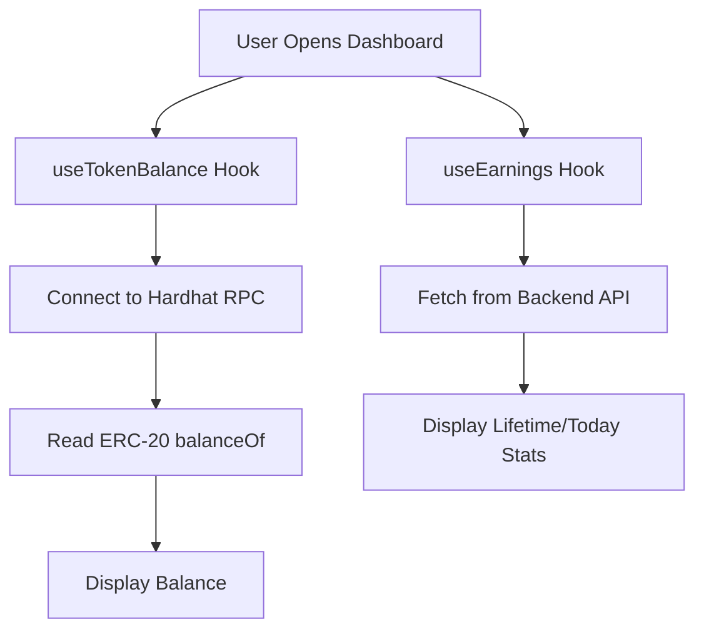
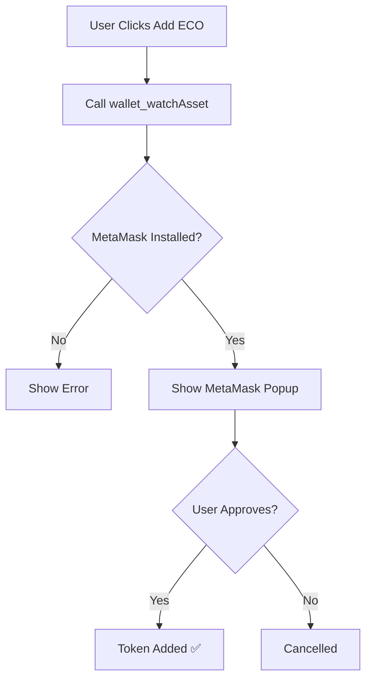

# 🌱 ECO Dashboard - Complete Guide

## What's Been Added

### ✨ Features

1. **Dashboard Page** with:
   - 🪙 **ECO Token Balance** (real-time from blockchain)
   - 📈 **Lifetime Earnings** (total ECO earned)
   - ☀️ **Today's Earnings** (last 24 hours)
   - 🎁 **Reward Rate** (5 ECO per verified post)
   - 🦊 **Add ECO to MetaMask** button (one-click token import)

2. **Auto-Deployment** when running `make dev`:
   - Hardhat node starts automatically
   - Contracts deployed to localhost
   - Contract addresses saved to frontend config
   - No manual deployment needed!

3. **Token Management**:
   - Read ERC-20 balance from blockchain
   - Auto-refresh every 10 seconds
   - Manual refresh button
   - Add ECO token to MetaMask with one click

## 🚀 Quick Start

### 1. Run Development Environment

```bash
make dev
```

This will:
- ✅ Start Redis
- ✅ Start Backend (port 8000)
- ✅ Start Hardhat node (port 8545)
- ✅ **Deploy contracts automatically**
- ✅ Start Web frontend (port 5173)

### 2. Access Dashboard

1. Connect your wallet
2. Create/complete your profile
3. Click the **🌱 Dashboard** button next to "View Profile"

### 3. Add ECO to MetaMask

1. Open Dashboard
2. Click **"🦊 Add ECO to Wallet"** button
3. Approve in MetaMask
4. ECO token now appears in your wallet!

## 📁 New Files Created

### Frontend

```
apps/web/src/
├── config/
│   ├── contracts.ts          ← Contract addresses & config
│   └── abis.ts               ← Contract ABIs (ERC-20, Verification)
├── hooks/
│   ├── useTokenBalance.ts    ← Read ECO balance from blockchain
│   └── useEarnings.ts        ← Fetch earnings stats from backend
└── pages/
    └── Dashboard.tsx         ← Main dashboard component
```

### Contracts

```
contracts/scripts/
└── auto-deploy.ts            ← Auto-deploy script for `make dev`
```

### Documentation

```
contracts/
├── BACKEND_EARNINGS_API.md   ← Backend API for earnings tracking
└── DASHBOARD_GUIDE.md        ← This file
```

## 🎯 How It Works

### Dashboard Display Flow



### Add Token Flow



## 🔧 Configuration

### Contract Addresses

Automatically set after deployment in:
- `apps/web/src/config/contracts.ts`
- `apps/web/.env.local`

Default addresses (from auto-deploy):
```typescript
rewardToken: "0x5FbDB2315678afecb367f032d93F642f64180aa3"
verification: "0xe7f1725E7734CE288F8367e1Bb143E90bb3F0512"
```

### RPC Endpoint

Dashboard connects to:
```
http://127.0.0.1:8545 (Hardhat local node)
```

Change in `useTokenBalance.ts` if needed.

## 📊 Backend Integration (Optional)

The dashboard can track earnings statistics via backend API.

### Add Earnings Endpoint

See [`BACKEND_EARNINGS_API.md`](./BACKEND_EARNINGS_API.md) for:
- `/api/verify/earnings/{wallet}` - Get earnings stats
- `/api/verify/claim/record` - Record successful claims

### Without Backend API

If backend endpoint doesn't exist:
- Dashboard shows "0" for lifetime/today earnings
- Everything else works normally
- No errors displayed (graceful fallback)

## 🎨 Dashboard Features

### Balance Card

```tsx
🌱 ECO Balance
━━━━━━━━━━━━━━━
  150.00 ECO
  ≈ $225.00 USD
  
  [🦊 Add ECO to Wallet]
```

### Stats Cards

| Lifetime Earned | Today's Earnings | Reward Rate |
|----------------|------------------|-------------|
| 150 ECO        | 25 ECO          | 5 ECO       |
| 30 claims      | Last 24 hours   | Per verified post |

### Information Sections

1. **How to Earn ECO**
   - Step-by-step guide
   - Clear instructions

2. **Contract Information**
   - Token address
   - Network details
   - Symbol & decimals

## 🔄 Auto-Refresh

- **Balance**: Refreshes every 10 seconds
- **Earnings**: Refreshes every 30 seconds
- **Manual Refresh**: Click "🔄 Refresh Balance" button

## 🐛 Troubleshooting

### "Failed to fetch balance"

**Solution:**
1. Check Hardhat node is running:
   ```bash
   curl http://127.0.0.1:8545
   ```
2. Verify contract addresses in `contracts.ts`
3. Check console for errors

### "Add ECO to Wallet" doesn't work

**Solution:**
1. Ensure MetaMask is installed
2. Check you're on the right network (Hardhat Local)
3. Try refreshing the page

### Dashboard shows 0 balance but I earned tokens

**Solution:**
1. Click "🔄 Refresh Balance" button
2. Check transaction was successful on blockchain
3. Verify you're looking at the correct wallet address

### Earnings show as 0

**Solution:**
1. Backend earnings API might not be implemented yet
2. See `BACKEND_EARNINGS_API.md` to add endpoint
3. This doesn't affect token balance (which reads from blockchain)

## 🚀 Production Deployment

### Environment Variables

Create `apps/web/.env.production`:

```env
VITE_REWARD_TOKEN_ADDRESS=0xYOUR_DEPLOYED_TOKEN
VITE_VERIFICATION_ADDRESS=0xYOUR_DEPLOYED_VERIFICATION
VITE_CHAIN_ID=137  # Polygon Mainnet
VITE_RPC_URL=https://polygon-rpc.com
```

### Update RPC in useTokenBalance.ts

```typescript
const provider = new ethers.JsonRpcProvider(
  import.meta.env.VITE_RPC_URL || 'http://127.0.0.1:8545'
)
```

### Token Icon

For production, host your own token icon:

```typescript
export const REWARD_TOKEN_ICON = "https://yourdomain.com/eco-icon.png";
```

## 📈 Next Steps

1. **Implement Backend Earnings API**
   - See [`BACKEND_EARNINGS_API.md`](./BACKEND_EARNINGS_API.md)
   - Track claims in database
   - Calculate lifetime/daily earnings

2. **Add Transaction History**
   - Show recent claims
   - Display transaction hashes
   - Link to block explorer

3. **Add Charts**
   - Earnings over time
   - Daily activity
   - Comparison with other users

4. **Leaderboard**
   - Top earners
   - Most eco-friendly users
   - Community stats

## 💡 Tips

1. **Use the Dashboard Button**: Located in the feed view, next to "View Profile"

2. **Add Token Once**: After adding ECO to MetaMask, it stays there permanently

3. **Check Balance**: Dashboard updates automatically, or click refresh

4. **Share Your Stats**: Screenshot dashboard to show your eco-friendly impact!

## 🎯 Key Files to Know

| File | Purpose |
|------|---------|
| `Dashboard.tsx` | Main dashboard UI |
| `useTokenBalance.ts` | Reads balance from blockchain |
| `useEarnings.ts` | Fetches stats from backend |
| `contracts.ts` | Contract addresses & config |
| `auto-deploy.ts` | Deploys contracts on `make dev` |
| `Makefile` | Runs everything with one command |

## ✅ Testing Checklist

- [ ] Run `make dev` - all services start
- [ ] Contracts deploy automatically
- [ ] Dashboard button appears in feed
- [ ] Balance displays correctly
- [ ] Refresh button works
- [ ] Add to Wallet button works
- [ ] Stats display (or show 0 gracefully)

## 🔗 Related Documentation

- [QUICKSTART.md](./QUICKSTART.md) - Get started quickly
- [README_VERIFICATION.md](./README_VERIFICATION.md) - Verification system
- [BACKEND_INTEGRATION.md](./BACKEND_INTEGRATION.md) - Python backend guide
- [FRONTEND_INTEGRATION.md](./FRONTEND_INTEGRATION.md) - React integration
- [BACKEND_EARNINGS_API.md](./BACKEND_EARNINGS_API.md) - Earnings API

---

**Built and working!** 🎉

Run `make dev` and click the 🌱 Dashboard button to see it in action!
