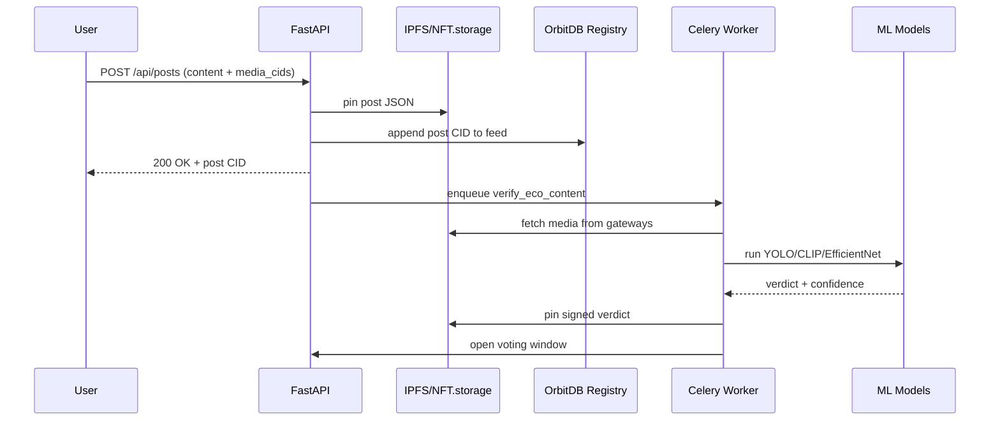
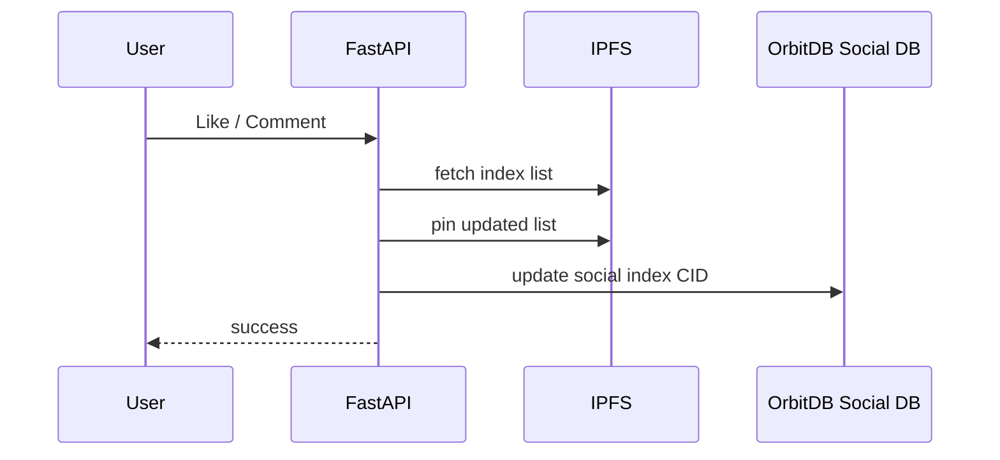
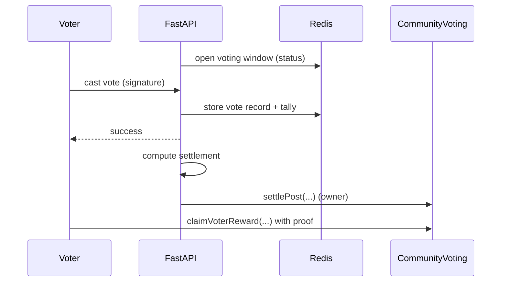
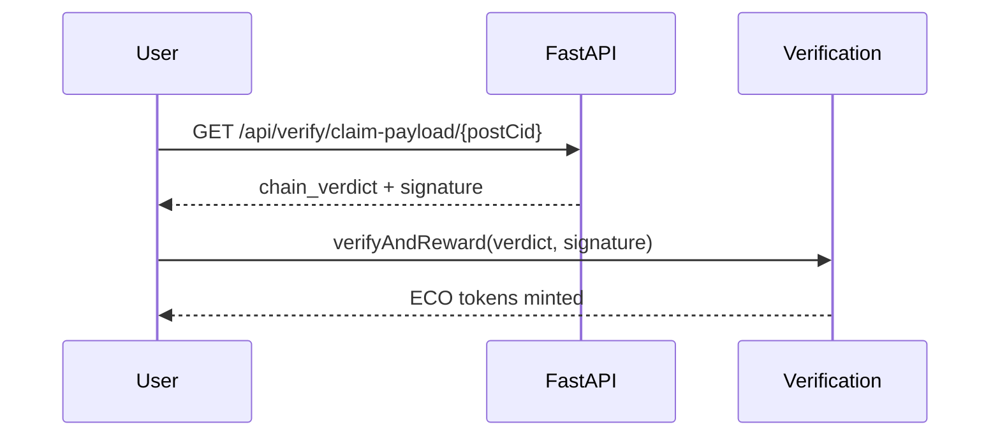

# Eco-DMS Backend + Contracts Architecture (Deep)

This document describes the backend and smart contracts in Eco-DMS, with deep explanations of the stack, responsibilities, data storage, and end-to-end data flows for profiles, posts, likes, comments, ML verification, and voting. It also calls out race conditions and failure modes where they can happen.

## 1) High-Level System Goals

- Fully decentralized content storage on IPFS.
- User-owned social data via OrbitDB-style addressable indexes on IPFS.
- Optional centralized acceleration (Redis) for performance only.
- ML-based eco-verification off-chain, with cryptographic signing for on-chain auditability.
- Hybrid community voting: off-chain votes, on-chain settlement.

## 2) Backend Tech Stack and Roles

### 2.1 FastAPI (HTTP API)
- Entry point for all backend routes.
- Provides endpoints for auth, profiles, posts, social actions, verification, notifications, and voting.
- Location: [backend/app/main.py](backend/app/main.py)

### 2.2 Redis (Ephemeral Cache + Queue)
- Cache for frequently read data (profiles, followers, votes status, etc.).
- Storage for off-chain voting data and rate-limits.
- Celery broker and result backend for ML verification tasks.
- Location: [backend/app/services/redis_service.py](backend/app/services/redis_service.py)

### 2.3 IPFS (Kubo) + Gateways
- Primary storage for content (posts, images, likes lists, comments lists, signed verdicts).
- Backend writes data to IPFS and returns CIDs as durable references.
- Gateways provide content retrieval with failovers.
- Location: [backend/app/services/ipfs_service.py](backend/app/services/ipfs_service.py)

### 2.4 OrbitDB-like Indexes (Address Registry + per-user DBs)
- OrbitDB addresses are simulated and persisted as IPFS JSON documents.
- Per-user "databases" are represented by IPFS CIDs (KeyValue or Feed/Log).
- A global IPFS registry maps wallet + db_type -> OrbitDB address.
- Redis caches this registry pointer; a local file backup protects against Redis wipe.
- Location: [backend/app/services/orbitdb_service.py](backend/app/services/orbitdb_service.py)

### 2.5 Pinata (Optional Pinning)
- Optional pinning fallback for IPFS content.
- Used when local IPFS is unavailable or for recovery of social indexes.
- Location: [backend/app/services/pinata_service.py](backend/app/services/pinata_service.py)

### 2.6 NFT.storage (Optional Media Pinning)
- Posts and images can be pinned via NFT.storage if a token is present.
- Used by the posts IPFS service for content pinning and retrieval.
- Location: [backend/app/posts_manage/ipfs_post_service.py](backend/app/posts_manage/ipfs_post_service.py)

### 2.7 Celery Worker (ML Job Execution)
- Async ML processing for eco-verification.
- Stores signed verdicts on IPFS and opens the voting window.
- Location: [backend/ml/worker.py](backend/ml/worker.py)

### 2.8 ML Models
- YOLOv8, CLIP, EfficientNet + custom scoring logic.
- Produces eco score (0..1) and verdict.
- Location: [backend/ml/inference.py](backend/ml/inference.py), [backend/ml/eco_scorer.py](backend/ml/eco_scorer.py)

### 2.9 EIP-712 Verdict Signing
- Signs verdicts so contracts can validate provenance.
- Produces typed data that matches Verification contract.
- Location: [backend/ml/signer.py](backend/ml/signer.py)

## 3) Smart Contracts (On-Chain Roles)

### 3.1 RewardToken.sol (ERC-20)
- ECO reward token.
- Only authorized minters can mint (Verification + CommunityVoting).
- Location: [contracts/contracts/RewardToken.sol](contracts/contracts/RewardToken.sol)

### 3.2 Verification.sol (ML-verified reward minting)
- Accepts signed ML verdicts (EIP-712).
- Enforces min confidence (>= 80), replay protection, cooldown, one reward per post.
- Mints ECO to post author upon valid verdict.
- Location: [contracts/contracts/Verification.sol](contracts/contracts/Verification.sol)

### 3.3 CommunityVoting.sol (Hybrid settlement)
- Off-chain votes are aggregated and settled on-chain.
- Backend computes final verdict, builds merkle tree of correct voters.
- Contract distributes rewards and updates reputation.
- Location: [contracts/contracts/CommunityVoting.sol](contracts/contracts/CommunityVoting.sol)

### 3.4 ProfileRegistry.sol (Simple on-chain handle registry)
- Optional identity registry for handles.
- Location: [contracts/contracts/ProfileRegistry.sol](contracts/contracts/ProfileRegistry.sol)

## 4) Core Data Storage Model

### 4.1 Content on IPFS
- Posts, likes lists, comments lists, notifications, verdicts are JSON on IPFS.
- CIDs are the primary identifiers and are immutable references.

### 4.2 OrbitDB-style Addressing
- "DB" address is a wrapper: `/orbitdb/<cid>/<db_name>`.
- Address is cached in Redis and backed up in IPFS registry.
- Global registry CID is stored in Redis and also a local file for durability.

### 4.3 Redis is Not the Source of Truth
- Redis caches for speed and for ephemeral voting windows and votes.
- All long-term data is on IPFS (or chain for rewards + reputation).

## 5) Backend Dataflows (Deep)

### 5.1 Profile Create/Read/Update Flow

**Summary:** Profiles are stored in OrbitDB (IPFS-based). Redis is only a cache.

**Flow:**
1. Client calls `GET /api/users/me` or `PUT /api/users/me`.
2. Backend fetches profile via OrbitDB address (if exists).
3. If missing, create default profile and store in OrbitDB.
4. New profile is saved to IPFS (OrbitDB entry) and registry is updated.
5. Redis caches the profile for fast reads.

**Implementation:**
- [backend/app/services/user_service.py](backend/app/services/user_service.py)
- [backend/app/services/orbitdb_service.py](backend/app/services/orbitdb_service.py)
- [backend/app/user_routes.py](backend/app/user_routes.py)

**Potential race conditions:**
- Two concurrent profile updates can write two different IPFS CIDs. The last write wins in OrbitDB address cache.
- If Redis is down, profile reads may be slower but still work via IPFS.

### 5.2 Post Create + Indexing Flow

**Summary:** Post content is pinned to IPFS. The author’s posts feed is updated in OrbitDB.

**Flow:**
1. Client posts to `POST /api/posts`.
2. Backend pins post JSON to IPFS (or NFT.storage if configured).
3. Backend updates the author’s OrbitDB posts feed with the new post CID.
4. If media exists, ML verification task is queued (async).

**Implementation:**
- [backend/app/posts_manage/post_routes.py](backend/app/posts_manage/post_routes.py)
- [backend/app/posts_manage/ipfs_post_service.py](backend/app/posts_manage/ipfs_post_service.py)
- [backend/app/services/orbitdb_service.py](backend/app/services/orbitdb_service.py)

**Potential race conditions:**
- Concurrent post creation can cause lost updates in the posts feed if two workers read the same feed and write different versions. The cache TTL (60s) can also serve stale lists. There is no explicit concurrency control for post feeds.

### 5.3 Likes Flow

**Summary:** Likes are stored as a list on IPFS, indexed in the post author’s social OrbitDB.

**Flow:**
1. Client calls like endpoint (in social service).
2. Backend fetches likes list from IPFS.
3. Backend appends wallet and re-pins likes list to IPFS (new CID).
4. Backend updates the social index in OrbitDB with the new likes index CID.

**Implementation:**
- [backend/app/services/social_service.py](backend/app/services/social_service.py)

**Potential race conditions:**
- Concurrent likes can cause lost updates if both requests read the same list and write new CIDs. The last write wins, potentially dropping the other like.
- A short social-data cache exists (5s) and can amplify stale reads in high concurrency.

### 5.4 Comments Flow

**Summary:** Comments are stored individually on IPFS and indexed by a comments index CID stored in social OrbitDB.

**Flow (conceptual):**
1. Client posts a comment.
2. Comment JSON is pinned to IPFS (new CID).
3. Comment index (list of comment CIDs) is updated and re-pinned.
4. Post author’s social index is updated with the new comments index CID.

**Implementation:**
- [backend/app/services/social_service.py](backend/app/services/social_service.py)

**Potential race conditions:**
- Same as likes: concurrent comments can overwrite one another’s index updates.

### 5.5 Notifications Flow

**Summary:** Notifications are stored in IPFS and indexed by OrbitDB address per user.

**Flow:**
1. Backend creates a notification JSON (with UUID).
2. The user’s notifications list is fetched from IPFS.
3. New notification is inserted and list is re-pinned to IPFS.
4. OrbitDB address is updated to point to new CID.

**Implementation:**
- [backend/app/services/notification_service.py](backend/app/services/notification_service.py)

**Potential race conditions:**
- Concurrent notifications for the same user can cause lost updates in the list.

### 5.6 ML Verification Flow

**Summary:** ML is off-chain; results are signed and optionally stored on IPFS.

**Flow:**
1. Post with media is created; backend queues `verify_eco_content` Celery task.
2. Worker fetches media from IPFS gateway (tries multiple gateways).
3. ML pipeline runs YOLOv8 + CLIP + EfficientNet and combines scores.
4. Verdict is signed using EIP-712 domain + typed data.
5. Signed verdict is pinned to IPFS; CID stored in local mapping file.
6. Backend opens a voting window for the post.

**Implementation:**
- [backend/ml/worker.py](backend/ml/worker.py)
- [backend/ml/inference.py](backend/ml/inference.py)
- [backend/ml/eco_scorer.py](backend/ml/eco_scorer.py)
- [backend/ml/signer.py](backend/ml/signer.py)

**Potential race conditions:**
- Multiple verification tasks for the same post can create multiple verdicts. The latest mapping wins in the local JSON file.
- If IPFS storage fails, verdict is stored locally only and on-chain claim must use off-chain payload.

### 5.7 Community Voting (Off-chain Window)

**Summary:** Votes are EIP-712 signed and stored in Redis. After window closes, backend computes settlement.

**Flow:**
1. ML completion opens a voting window (duration depends on ML confidence).
2. Users submit vote: backend enforces token-balance threshold and rate limits.
3. Votes are stored in Redis (private per-voter records).
4. On settlement, backend computes final verdict using weighted score and prepares merkle data for chain settlement.

**Implementation:**
- [backend/app/services/voting_service.py](backend/app/services/voting_service.py)
- [backend/app/voting_routes.py](backend/app/voting_routes.py)
- [backend/app/verify_routes.py](backend/app/verify_routes.py)

**Potential race conditions:**
- Redis TTL or eviction can drop votes before settlement, which can affect quorum and outcomes.
- Multiple workers can attempt to settle concurrently if not coordinated.

## 6) Contract Dataflows (Deep)

### 6.1 ML Verdict Reward (Verification.sol)

**Goal:** Mint ECO tokens for posts verified eco-friendly by ML.

**Flow:**
1. Backend produces signed EIP-712 verdict.
2. Frontend submits `verifyAndReward(verdict, signature)` on-chain.
3. Contract checks:
   - Signature matches authorized verifier.
   - Confidence >= 80.
   - Timestamp not in future and within 1 hour.
   - Nonce unused.
   - Post CID not previously rewarded.
   - Wallet not in cooldown.
4. RewardToken mints 5 ECO to poster.

**Implementation:**
- [contracts/contracts/Verification.sol](contracts/contracts/Verification.sol)
- [contracts/contracts/RewardToken.sol](contracts/contracts/RewardToken.sol)

### 6.2 Community Voting Settlement (CommunityVoting.sol)

**Goal:** Hybrid verdict and community reward distribution.

**Flow:**
1. Backend computes settlement after voting window closes.
2. Backend calls `settlePost(postCid, poster, isEco, mlConfidencePct, communityWeightPct, merkleRoot)`.
3. Contract mints poster reward if eco, stores merkle root.
4. Correct voters claim with `claimVoterReward(postCid, voterShare, proof)`.
5. Backend can update reputation via `updateReputation()`.

**Implementation:**
- [contracts/contracts/CommunityVoting.sol](contracts/contracts/CommunityVoting.sol)

## 7) Dataflow Diagrams (Mermaid)

### 7.1 Post Creation + ML Verification

### 7.2 Likes + Comments Flow

### 7.3 Voting Window + Settlement

### 7.4 ML Reward Claim

## 8) Failure Modes and Mitigations

### 8.1 IPFS Unavailable
- IPFS service falls back to Pinata where configured.
- Multiple gateway fallbacks are used for reads.

### 8.2 Redis Wipe
- OrbitDB registry pointer is backed up to a local file.
- Registry itself is stored on IPFS.
- Voting data in Redis is still volatile (by design).

### 8.3 Race Conditions
- Likes/comments index updates are not atomic. Concurrent updates can drop data.
- Posts feed updates can lose entries under concurrent write pressure.
- Notifications list updates can drop entries when multiple writes happen at once.

### 8.4 ML Pipeline Failures
- If ML fails, verification status stays pending and no voting window opens.
- If verdict storage on IPFS fails, verdict is still returned, but claim must use off-chain data.

## 9) Recommended Hardening (If Needed)

- Introduce optimistic concurrency (versioning) for likes/comments indexes.
- Move voting records to a durable store or periodic IPFS snapshots for auditability.
- Add lock or compare-and-set strategy for posts feed updates.
- Persist ML verdict mapping to Redis or IPFS, not just local JSON.

## 10) Key Files (Backend + Contracts)

- API wiring: [backend/app/main.py](backend/app/main.py)
- Auth (SIWE): [backend/app/auth_routes.py](backend/app/auth_routes.py)
- Posts routes: [backend/app/posts_manage/post_routes.py](backend/app/posts_manage/post_routes.py)
- Profiles routes: [backend/app/user_routes.py](backend/app/user_routes.py)
- Verification routes: [backend/app/verify_routes.py](backend/app/verify_routes.py)
- Voting routes: [backend/app/voting_routes.py](backend/app/voting_routes.py)
- Social service: [backend/app/services/social_service.py](backend/app/services/social_service.py)
- OrbitDB service: [backend/app/services/orbitdb_service.py](backend/app/services/orbitdb_service.py)
- IPFS services: [backend/app/services/ipfs_service.py](backend/app/services/ipfs_service.py), [backend/app/posts_manage/ipfs_post_service.py](backend/app/posts_manage/ipfs_post_service.py)
- ML worker: [backend/ml/worker.py](backend/ml/worker.py)
- ML inference: [backend/ml/inference.py](backend/ml/inference.py)
- Verdict signer: [backend/ml/signer.py](backend/ml/signer.py)
- Contracts: [contracts/contracts/Verification.sol](contracts/contracts/Verification.sol), [contracts/contracts/RewardToken.sol](contracts/contracts/RewardToken.sol), [contracts/contracts/CommunityVoting.sol](contracts/contracts/CommunityVoting.sol), [contracts/contracts/ProfileRegistry.sol](contracts/contracts/ProfileRegistry.sol)
