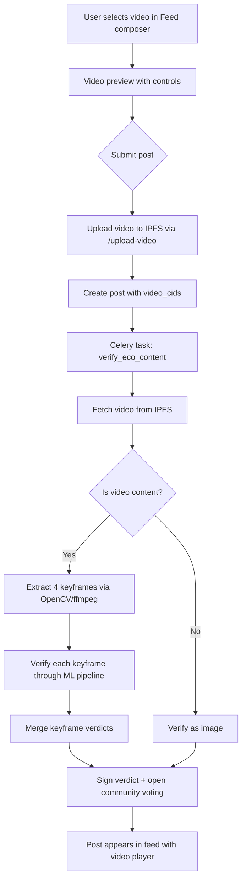

# Video Support Integration — Summary

## Overview
Full video support has been integrated into Eco-DMS, following the same decentralized architecture as image posts. Users can now upload, preview, and play videos in the feed, with ML verification via keyframe extraction.

## Files Modified

### Backend (Python)

| File | Changes |
|------|---------|
| [models.py](file:///d:/canvas/eco-dms/eco-dms/backend/app/models.py) | Added `VideoUpload` response model + `video_cids` field to `PostCreate` |
| [post_routes.py](file:///d:/canvas/eco-dms/eco-dms/backend/app/posts_manage/post_routes.py) | Added `/upload-video` endpoint, updated `create_post` to include `video_cids`, updated retry-verification to handle video CIDs |
| [inference.py](file:///d:/canvas/eco-dms/eco-dms/backend/ml/inference.py) | Added video keyframe extraction (`_extract_keyframes_from_video`, `_is_video_content`, `_fetch_content_from_ipfs`) and video-aware `verify_images_from_ipfs` |

### Frontend (TypeScript/React)

| File | Changes |
|------|---------|
| [api.ts](file:///d:/canvas/eco-dms/eco-dms/apps/web/src/api.ts) | Added `uploadVideo()` function + `video_cids` to `NotificationPost` |
| [Feed.tsx](file:///d:/canvas/eco-dms/eco-dms/apps/web/src/pages/Feed.tsx) | Video state management, file picker, preview in composer, upload flow, passing `videoUris` to PostCard |
| [PostView.tsx](file:///d:/canvas/eco-dms/eco-dms/apps/web/src/pages/PostView.tsx) | Added `video_cids` to Post type, video URL resolution, HTML5 video player section |
| [PostCard.tsx](file:///d:/canvas/eco-dms/eco-dms/packages/ui/src/components/PostCard.tsx) | Added `videoUris` prop, inline `<video>` player with controls |

## Architecture

## Key Design Decisions

1. **Keyframe extraction strategy**: Videos are sampled at 4 evenly-spaced keyframes. Each keyframe goes through the full ML pipeline (YOLO + CLIP + EfficientNet). Results are averaged for the final video verdict.

2. **Extraction backends**: OpenCV (`cv2`) is tried first, then `ffmpeg` subprocess, then PIL fallback — ensuring maximum compatibility across environments.

3. **Video size limit**: 100MB max (vs 10MB for images), balancing usability with IPFS pinning costs.

4. **Decentralization preserved**: Videos are pinned to IPFS just like images. No central database stores video data. The `video_cids` array is stored in the post's IPFS JSON metadata.

5. **Same verification flow**: Videos go through the exact same fraud detection → ML inference → CO₂ scoring → community voting → on-chain reward pipeline as images.

## Validation

- ✅ Backend Python syntax check — all 3 modified files pass
- ✅ Frontend Vite production build — succeeds (2016 modules transformed)
- ✅ UI package TypeScript check — passes
